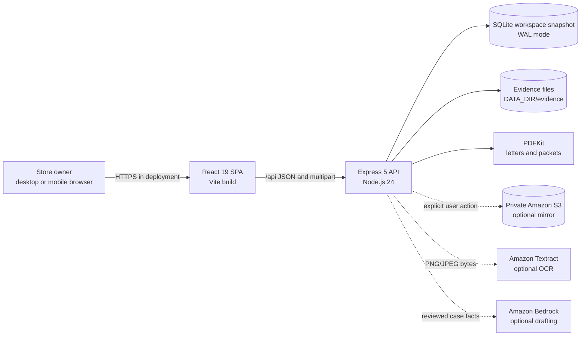
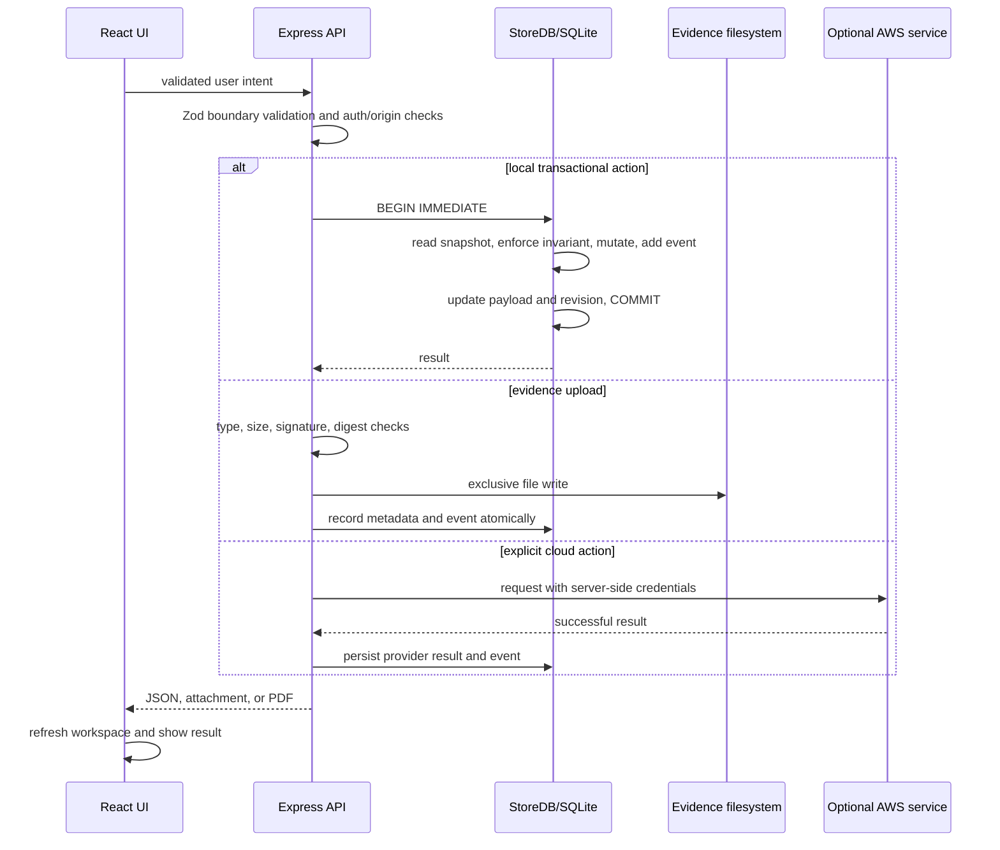
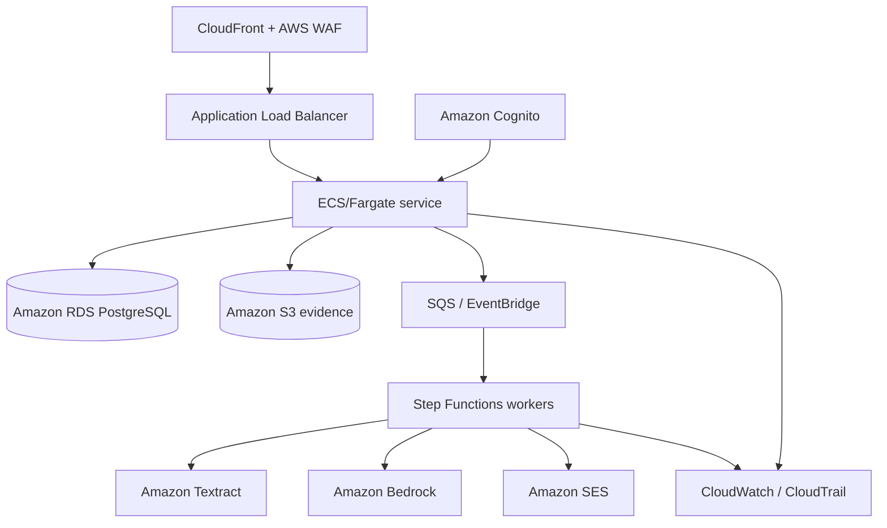

# System Architecture

## Architectural style

The current release is a modular monolith deployed as one Node.js process:

- React and Vite provide the browser application.
- Express provides the HTTP API and serves the built frontend.
- SQLite stores one versioned workspace snapshot transactionally.
- The filesystem stores original evidence bytes.
- PDFKit produces letters and case packets.
- AWS SDK v3 adapters optionally call S3, Textract, and Bedrock.

This shape minimizes deployment complexity and keeps all financial/inventory mutations inside one transaction boundary. It is suitable for a local demo or one owner on one application instance. It is not a horizontally scaled multi-tenant architecture.

## Current runtime topology



In development, Vite runs at `127.0.0.1:5173` and proxies `/api` to Express at `127.0.0.1:3001`. The custom development launcher starts the API, polls `/api/health`, and starts Vite only after the API is ready. This prevents the initial bootstrap request from racing the backend.

In the production build, Express serves `dist/` and the API from the same origin and port.

## Component responsibilities

### Browser application

| Module              | Responsibility                                                           |
| ------------------- | ------------------------------------------------------------------------ |
| `src/main.tsx`      | Router, error boundary, providers, global styles, toast host             |
| `src/Landing.tsx`   | Public full-viewport brand entry                                         |
| `src/App.tsx`       | Operational shell, overview, cases list, tasks, activity, settings       |
| `src/CasePage.tsx`  | Case detail, evidence, drafts, payment ledger, checklist, packet actions |
| `src/StockPage.tsx` | Store/lot creation and transfer workflow                                 |
| `src/lib.tsx`       | API client, workspace state/provider, formatting, shared UI primitives   |
| `src/styles.css`    | Responsive operational design system and dark theme                      |
| `src/landing.css`   | Landing composition, artwork treatment, and motion                       |

The landing route does not require the workspace provider, so `/` can render even if the API is unavailable. Operational routes load `/api/bootstrap` and work from the returned authoritative snapshot.

### Server application

| Module               | Responsibility                                                             |
| -------------------- | -------------------------------------------------------------------------- |
| `server/index.ts`    | Environment loading, public-bind safety check, listener, graceful shutdown |
| `server/app.ts`      | Validation, authentication, API routes, domain transitions, uploads, PDFs  |
| `server/store.ts`    | SQLite initialization, atomic mutation boundary, seed/empty state, events  |
| `server/aws.ts`      | Capability detection and AWS SDK calls                                     |
| `shared/types.ts`    | Data contracts shared by frontend and backend                              |
| `shared/calendar.ts` | Asia/Kolkata calendar-day semantics                                        |

## Request flow



Cloud calls complete before their success metadata is committed. A failed S3, Textract, or Bedrock request does not alter financial balances or inventory. Evidence uploaded locally remains available if a later cloud operation fails.

## Persistence model

SQLite contains one table:

```sql
workspace(
  id INTEGER PRIMARY KEY CHECK(id = 1),
  schema_version INTEGER NOT NULL DEFAULT 1,
  revision INTEGER NOT NULL DEFAULT 0,
  payload TEXT NOT NULL
)
```

`payload` is the serialized `State` object. Each mutation:

1. starts `BEGIN IMMEDIATE`;
2. reads and parses the current snapshot;
3. applies domain logic in memory;
4. writes the complete updated snapshot and increments `revision`;
5. commits, or rolls back on any error.

SQLite uses WAL mode and a 5-second busy timeout. Evidence bytes are stored as `DATA_DIR/evidence/<evidence-id>`; metadata and SHA-256 digest live in the workspace snapshot.

### Why this design exists

- Cross-entity changes such as payment plus case status or transfer plus two stock lots are atomic.
- Backup scope is easy to explain: database and evidence directory form one unit.
- The domain is navigable as typed collections during a hackathon-scale release.

### Limits

- The complete state is rewritten per mutation.
- There is one writer and one owner workspace.
- Filesystem evidence and the SQLite commit are coordinated by application compensation, not one storage transaction.
- Independent replicas would diverge and must not be placed behind a load balancer.

## Build and serving model

The Dockerfile is a two-stage Node 24 build. The build stage installs dependencies and runs TypeScript/Vite compilation. The runtime stage copies the production bundle, server, shared code, and dependencies, runs as the unprivileged `node` user, declares `/app/data` as a volume, and exposes port `3001`. A health check calls `/api/health` every 30 seconds.

## Architectural decisions

| Decision                     | Reason                                          | Consequence                                   |
| ---------------------------- | ----------------------------------------------- | --------------------------------------------- |
| Modular monolith             | Lowest operational complexity for one workspace | Scale-out requires repository extraction      |
| Integer paise                | Exact financial arithmetic                      | API clients send integer minor units          |
| Deterministic state machines | Money and stock must not depend on AI           | More rules live server-side                   |
| Optional AWS adapters        | Local product remains demonstrable              | Cloud capability is feature-gated             |
| Original-file preservation   | Evidence must remain inspectable                | Database and file backup must stay consistent |
| Server-generated PDFs        | Durable export independent of browser printing  | Font and page rendering require verification  |
| Same-origin production       | Simpler cookies and origin policy               | Static frontend ships with API service        |

## Future production topology

The proposed scale architecture replaces local state, rather than pretending SQLite can be replicated:



This diagram is a **proposed** evolution. Cognito, RDS, Fargate, queues, Step Functions, SES, WAF, and multi-tenant authorization are not implemented in the current repository.
