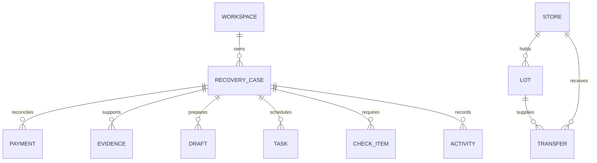
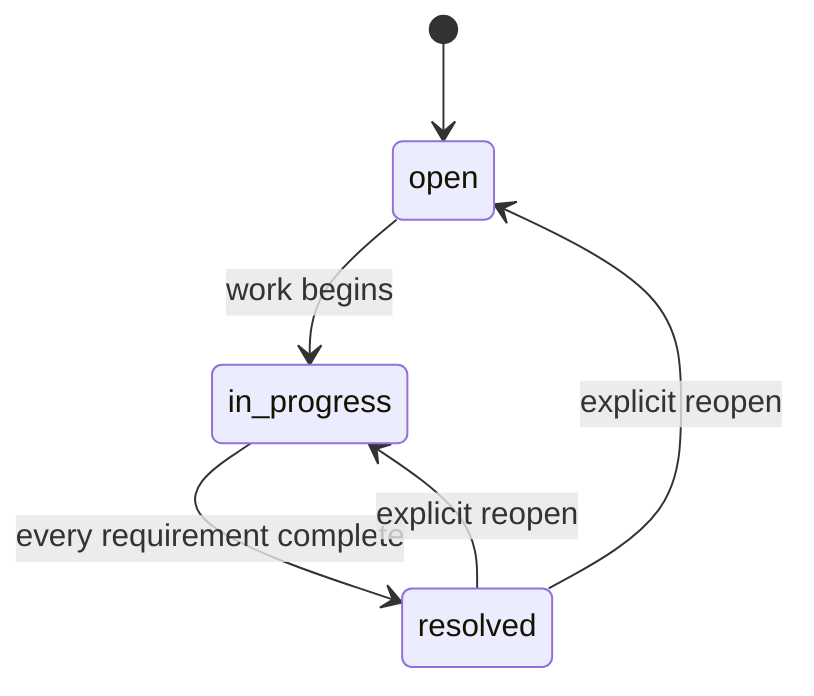
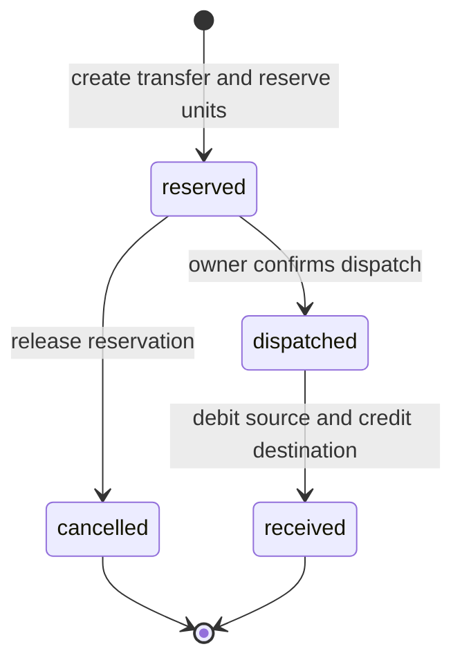

# Domain Model and Workflows

## Ubiquitous language

| Term          | Meaning in ClaimChain                                                                            |
| ------------- | ------------------------------------------------------------------------------------------------ |
| Workspace     | One owner-controlled business context and all of its records                                     |
| Recovery case | A payment obligation, document recovery, or dispute being advanced toward resolution             |
| Evidence      | An original uploaded file plus immutable identity metadata and optional extracted text/cloud key |
| Draft         | Editable correspondence that has not been sent by ClaimChain                                     |
| Follow-up     | A dated task linked to a case                                                                    |
| Requirement   | A checklist item that gates resolution for document/dispute cases                                |
| Store         | A location participating in inventory ownership or receipt                                       |
| Lot           | Stock identified by store, SKU, batch, expiry, unit, quantity, and reserved quantity             |
| Transfer      | A reservation and movement of units from one lot to another store                                |
| Activity      | A durable event describing an actual state change                                                |

## Entity relationships



The TypeScript definitions in `shared/types.ts` are the current data contract. Records use UUIDs except seeded demo IDs and human-readable case numbers.

## Financial model

All money values are integer paise. A principal of `4850000` is INR 48,500.00.

```text
outstanding(case) = case.amount - sum(case payments)
```

Invariants:

- Only payment cases accept payments.
- Payment amounts are positive integers.
- A payment date cannot be in the future.
- A payment cannot exceed the current outstanding amount.
- A reference is unique within a case, case-insensitively.
- A client idempotency key can replay the exact same payment safely.
- Reusing a key with different details is a conflict.
- A partially paid case becomes `in_progress`.
- A fully paid case becomes `resolved` and cannot be reopened.
- A payment case cannot be manually resolved while money remains outstanding.

## Case state machines

### Payment case

```mermaid
stateDiagram-v2
    [*] --> open
    open --> in_progress: draft prepared or partial payment
    open --> resolved: full payment
    in_progress --> resolved: final payment
    resolved --> resolved: terminal; reopening rejected
```



### Document or dispute case



A completed requirement cannot be reversed while its case remains resolved. Reopening first makes the intended change explicit.

## Evidence lifecycle

1. The server accepts one file up to 10 MiB.
2. Allowed MIME types are PDF, PNG, JPEG, and plain text.
3. Magic-byte/content checks reject disguised uploads.
4. SHA-256 is calculated before persistence.
5. Duplicate bytes within a case return the existing record.
6. The original bytes are written under an opaque server-generated ID.
7. Plain text is captured locally; binary evidence starts as “Not extracted.”
8. Optional Textract extraction updates `text` and provider metadata.
9. Optional S3 mirroring adds `cloudKey` only after a successful `PutObject`.

A digest proves that two byte sequences match. It does not prove authorship or authenticity.

## Draft lifecycle

Drafts are generated either by a deterministic local template or an explicit Bedrock request. Both remain editable and unsent.

Each draft has a monotonically increasing `revision`. A save must include the revision the editor loaded. If another update has already incremented it, the server returns `409 Conflict` rather than silently overwriting newer work.

The UI also protects dirty drafts from accidental Escape/backdrop dismissal and requires an explicit discard action.

## Follow-up behavior

Follow-ups are case-linked tasks with a due date and nullable completion timestamp. Completing an incomplete task adds one activity event. Repeating the same completion request is a no-op. Reopening a completed task clears the timestamp and adds one reopening event.

## Inventory calculations

```text
available(lot) = lot.quantity - lot.reserved
```

Reservations increase `reserved` immediately. This prevents a second transfer from consuming the same units even before dispatch.

## Transfer state machine



Invariants:

- Source and destination stores must differ.
- Destination store and source lot must exist.
- Quantity must be positive and no greater than available stock.
- Expired stock cannot be reserved or dispatched.
- Cancellation is allowed only from `reserved` and releases units.
- Receipt is allowed only from `dispatched`.
- Receipt debits source `quantity` and `reserved` once.
- Receipt increments a matching destination lot or creates one.
- `received` and `cancelled` are terminal states.

## Activity semantics

Activity is appended only when a meaningful mutation occurs. Examples include case opened, payment recorded, evidence added/extracted/mirrored, draft prepared/revised, follow-up completed/reopened, requirement updated, stock reserved, and transfer received.

Activity is operational history, not a tamper-proof compliance ledger. A production audit system would need immutable centralized storage, actor identity, request correlation, retention policy, and administrative access controls.

## Time semantics

Business dates use the `Asia/Kolkata` calendar boundary. Stored event timestamps are ISO UTC instants; displayed due dates and “today” behavior use India time. The distinction is tested across midnight and year rollover.
