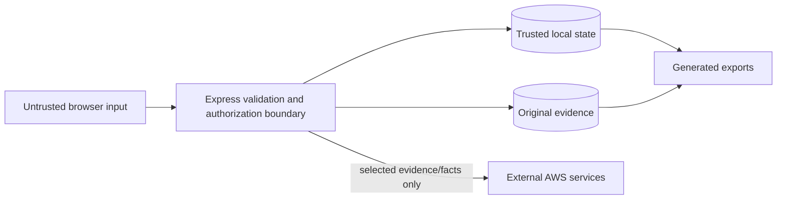

# Security, Privacy, and Reliability

## Security posture

ClaimChain's current controls are appropriate for a local or tightly controlled single-workspace deployment. They are not a substitute for a full security program or tenant-isolated public SaaS architecture.

## Trust boundaries

Uploaded files, extracted text, case descriptions, counterparties, filenames, and model output are untrusted data. They must never become executable HTML, filesystem paths, credentials, or model instructions.

## Implemented controls

### Input and domain validation

- Zod validates JSON bodies, date format, enums, string bounds, and integer money/quantity limits.
- Financial and inventory transitions are enforced server-side.
- Unknown IDs and invalid transitions fail rather than being silently accepted.
- React renders text without raw HTML injection.

### File handling

- Uploads are memory-buffered with one-file and 10 MiB limits.
- Only PDF, PNG, JPEG, and text MIME types are accepted.
- Magic bytes/content checks reject common disguised files.
- Filenames are stripped of control characters and limited to 200 characters.
- Server-generated UUIDs, not client paths, determine storage paths.
- Files are served as downloads with `X-Content-Type-Options: nosniff`.
- SHA-256 detects duplicate bytes and identifies packet entries.

No malware scanner is implemented. Public deployment should scan uploads before making them available to users or downstream processors.

### Authentication and sessions

- Authentication is mandatory and uses individual username/email accounts.
- Passwords are salted scrypt hashes; verification/reset codes and opaque session tokens are stored only as SHA-256 digests.
- Three server-enforced roles provide capability checks; recovery operators also require explicit case/store assignment.
- Failed login and code requests are rate-limited per process/IP/identifier.
- Session cookies are HTTP-only, `SameSite=Lax`, scoped to `/`, and expire server-side after the configured lifetime.
- Verification and password recovery codes are short-lived, single-use, and revoke sessions after reset.
- Security-sensitive decisions are recorded in a normalized audit table without credentials or raw tokens.
- Non-loopback binding requires a strong bootstrap password, `AUTH_COOKIE_SECURE=true`, and `APP_ORIGIN`.

This is workspace-level RBAC, not tenant isolation or MFA. Process-local rate limits reset on restart and do not coordinate across replicas. See [Authentication, RBAC, and simulation](10-AUTH_RBAC_AND_SIMULATION.md).

### Request and browser protections

- Mutating API requests reject unrecognized origins.
- `X-Frame-Options: DENY` blocks framing.
- `Referrer-Policy: same-origin` limits referrer leakage.
- `Cache-Control: no-store` avoids caching sensitive API responses.
- `X-Powered-By` is disabled.
- Production frontend/API sharing one origin simplifies the session boundary.

A strict Content Security Policy is not currently set and should be added before broad public exposure.

### AWS credentials and permissions

- AWS clients run only on the server.
- The default credential chain supports instance roles.
- The browser never receives AWS credentials.
- Capability buttons depend on server-side configuration.
- The deployment policy should permit only the bucket prefix, Textract action, and selected Bedrock resources.

### AI safety boundary

- Bedrock is optional and invoked only by an explicit user action.
- Evidence is labeled as untrusted data in the system instruction.
- The model is prohibited from inventing facts, legal provisions, penalties, threats, signatures, or delivery claims.
- Output is stored as an editable draft with a visible provider/review requirement.
- AI does not change balances, stock, checklists, payments, or transfer states.

Prompt-injection resilience is limited to instruction/data separation and constrained use. Production should add model/output evaluations, content controls appropriate to the domain, observability, and human approval policy.

## Privacy and data classification

Potentially sensitive fields include business identity, contact details, counterparties, invoice references, financial amounts, uploaded evidence, extracted text, and correspondence.

Recommended classification:

| Class        | Examples                                           | Handling                             |
| ------------ | -------------------------------------------------- | ------------------------------------ |
| Public       | Product landing copy                               | No special restriction               |
| Internal     | Stock catalog, task titles                         | Authenticated workspace only         |
| Confidential | Case facts, invoices, evidence, payment references | Encryption, least privilege, no logs |
| Secret       | Password, session secret, AWS credentials          | Secret manager/runtime only          |

The sample workspace is fictional and explicitly labeled. Do not use real sensitive records in public demos.

## Data lifecycle

The current release supports creation and export but does not implement per-record deletion, retention schedules, legal hold, subject access workflows, or secure erasure. S3 mirroring can produce a second copy without an application deletion path. These controls must be designed before processing regulated or contractual evidence.

## Reliability mechanisms

- SQLite mutations use `BEGIN IMMEDIATE` and rollback on failure.
- WAL mode and busy timeout support the single-process write pattern.
- Payment idempotency keys prevent duplicate client retries.
- Document revisions prevent lost updates.
- Transfer state machines prevent duplicate stock credit.
- Cloud success metadata is written only after the provider succeeds.
- Graceful SIGINT/SIGTERM shutdown closes the listener and database.
- Docker health check calls `/api/health`.
- The development launcher waits for API readiness before Vite starts.

## Threat model summary

| Threat                        | Current mitigation                      | Residual risk / next control                                   |
| ----------------------------- | --------------------------------------- | -------------------------------------------------------------- |
| Unauthorized workspace access | Optional password + signed cookie       | Add individual identity, MFA, RBAC, audit actor                |
| Cross-site mutation           | Origin check + SameSite cookie          | Add CSRF token for broader deployment patterns                 |
| Malicious upload              | Type, size, signature, opaque path      | Add malware scanning and quarantine                            |
| Stored script content         | React escaping; no raw HTML             | Add CSP and security regression tests                          |
| Payment replay                | Idempotency key + duplicate reference   | Use provider/webhook verification in real finance integrations |
| Inventory race                | One transactional writer                | Use row/version locking in distributed datastore               |
| Prompt injection              | Evidence treated as data; output review | Add evals, policy enforcement, structured output               |
| Credential leakage            | Server-only SDK and instance role       | Central secrets, rotation, detection, CloudTrail               |
| Data loss                     | SQLite WAL; documented volume backup    | Automate consistent backups and restore drills                 |
| Host compromise               | Container runs as non-root              | Harden AMI, patching, EDR, network segmentation                |

## Pre-production security gate

- [ ] HTTPS and secure cookies verified.
- [ ] Strong secrets sourced from a managed secret store.
- [ ] S3 Block Public Access and least-privilege IAM verified.
- [ ] EBS/S3 encryption and backup restore tested.
- [ ] CSP, HSTS, proxy limits, and request logging configured.
- [ ] Upload malware scanning and deletion/retention policy implemented.
- [ ] Individual identity and authorization implemented for multiple users.
- [ ] Dependency, container, and infrastructure scanning enabled.
- [ ] Penetration test and privacy/legal review completed.
- [ ] Bedrock model/prompt evaluation and human approval policy documented.
