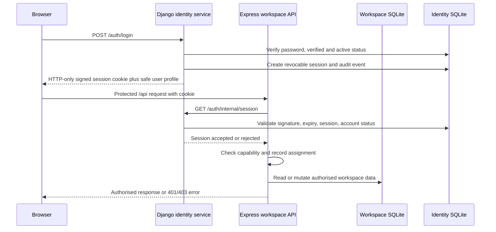

# ClaimChain Django Identity and RBAC Implementation

## Purpose

This document explains how ClaimChain signs users in and controls access to the workspace. It is both an operational guide for administrators and a technical reference for contributors.

Django is ClaimChain's identity authority. It owns accounts, password hashes, email-verification codes, password-reset codes, sign-in sessions, session revocation, and authentication audit records. Express remains the operational API: it owns cases, payments, evidence, documents, inventory, follow-ups, and simulation. This division keeps identity concerns separate from recovery-workspace behaviour without requiring a separate cloud identity product for the current single-instance deployment.

## What a user experiences

1. An administrator creates an account with a username, email address, temporary password, role, and, for an operator, optional case and store assignments.
2. The account begins unverified. ClaimChain sends a one-time six-digit verification code by email.
3. The recipient enters the code on the verification screen. A verified account can sign in with either its username or email address.
4. On a successful sign-in, ClaimChain opens the workspace with only the screens and actions appropriate for that role.
5. A user who forgets a password requests a reset code. The request response is intentionally generic so it does not reveal whether an account exists.
6. After a valid reset code and a strong new password are provided, all existing sessions for that account are revoked. The user signs in again with the new password.
7. Logging out revokes the current session. An administrator disabling an account, changing its role, or replacing its password revokes its active sessions.

Development mode can display a code in the API response only when `AUTH_EXPOSE_CODES=true`. That setting exists solely for local UI work and must be `false` in a real deployment.

## Three roles

ClaimChain intentionally has three roles. This keeps the competition release understandable and avoids a misleading appearance of enterprise-grade permission customisation that has not been implemented.

| Role | Workspace scope | Operational access |
| --- | --- | --- |
| **Workspace administrator** | Entire workspace | Full control of cases, payments, evidence, documents, follow-ups, inventory, transfers, workspace settings, accounts, security audit, and synthetic ingestion. |
| **Recovery operator** | Explicitly assigned case and store IDs | Can work assigned recovery cases and inventory handoffs: update cases, record payments, manage evidence, prepare drafts, manage tasks, export packets, and manage assigned inventory. An empty assignment grants no records. |
| **Read-only auditor** | Entire workspace | Can view the dashboard, cases, inventory, and activity, and export packets. Cannot alter operational, account, or workspace data. |

The canonical capability contract is [`../shared/auth.ts`](../shared/auth.ts). The React application uses it to present appropriate navigation and controls. Django returns the matching capability list in the authenticated user profile. Express applies the same capability contract before each protected operation. The interface is therefore a convenience layer, not the security boundary.

## End-to-end request path

Express does not trust a role supplied by the browser. It first verifies the cookie signature locally, then calls Django's internal session endpoint. This means a logout, password reset, account disablement, role change, or session revocation takes effect for workspace requests without waiting for the browser to clear stale state.

## Django data model

The identity database is stored separately at `data/claimchain-auth.sqlite3` in local and single-instance deployment. It contains the following primary records:

| Record | Purpose | Sensitive values stored safely |
| --- | --- | --- |
| `User` | Username, email, display name, role, verified/active state, and optional assignment scopes. | Django password hash, never a plaintext password. |
| `UserSession` | One signed sign-in session with expiry and revocation state. | SHA-256 digest of the issued session token, never the token itself. |
| `AuthCode` | A single-use verification or reset request, expiry, attempts, and usage status. | SHA-256 digest of the one-time code, never the code itself. |
| `SecurityAudit` | Authentication, provisioning, reset, logout, account-change, and denied-access history. | No password, cookie, or code values. |

The workspace data stays separate in `data/claimchain.sqlite`. Splitting the two databases makes the identity boundary explicit while preserving a simple single-host operational model.

## Session design

After login, Django creates a `UserSession` record and signs a compact session token with `AUTH_TOKEN_SECRET`. The browser receives that token only as the `claimchain_session` HTTP-only cookie. JavaScript cannot read it.

The cookie is `SameSite=Lax`, scoped to `/`, and has the configured `AUTH_SESSION_TTL_HOURS` lifetime. A public deployment must use HTTPS and set `AUTH_COOKIE_SECURE=true`. Django validates token integrity, expiry, session revocation, account activity, and verification status. Express then performs the same session validation through Django before serving a workspace request.

## Verification and password recovery

### Email verification

- `POST /auth/verify/send` creates a verification request for an unverified active account.
- A newer request invalidates earlier unused verification codes for that account.
- `POST /auth/verify/confirm` accepts the request ID, identity, and code once, then marks the account verified.
- Verification attempts are rate limited and codes expire after `AUTH_CODE_TTL_MINUTES`.

### Password recovery

- `POST /auth/forgot` always returns a neutral message. This prevents account enumeration.
- For an active, verified account, Django creates and delivers one reset code.
- `POST /auth/reset` validates the request ID, code, and password policy, changes the Django password hash, consumes the code, and revokes every active session for that user.
- Passwords must satisfy Django validation and include uppercase, lowercase, numeric, and symbol characters.

The normal mail path uses Django's mail backend. Local development uses console delivery when SMTP is not configured. The selected AWS deployment uses Amazon SES SMTP after the sender identity and domain have been verified.

## Route ownership and endpoints

| Route group | Owner | Purpose |
| --- | --- | --- |
| `/auth/health` | Django | Authentication service health check. |
| `/auth/login`, `/auth/me`, `/auth/logout` | Django | Sign-in, authenticated profile, and sign-out. |
| `/auth/verify/*`, `/auth/forgot`, `/auth/reset` | Django | Verification and password-recovery lifecycle. |
| `/auth/admin/*` | Django | Administrator-only account, role, verification resend, and security-audit administration. |
| `/auth/internal/session` | Django | Internal validation endpoint used by Express; it must not be exposed as a public integration contract. |
| `/api/*` | Express | Recovery workspace, evidence, payment, inventory, document, export, and simulation actions. |

During local development, Vite proxies `/auth` to Django on port `8000` and `/api` to Express on port `3001`. In production, both stay behind one HTTPS origin; the reverse proxy sends `/auth` to Django and `/api` to Express. This same-origin design keeps cookies and browser requests predictable.

## RBAC enforcement points

Authorisation is intentionally checked more than once:

1. **Navigation:** React hides screens that the account cannot use.
2. **Action controls:** React disables or omits unauthorised commands.
3. **Django administration endpoints:** Django checks `manage_users` before account or audit operations.
4. **Express API endpoints:** Express checks the relevant capability for every protected read or mutation.
5. **Record scope:** For recovery operators, Express checks the requested case or store against the account's assigned IDs before serialising or changing data.
6. **Bootstrap filtering:** The initial workspace payload is filtered before it leaves Express, so an operator receives only assigned records and their dependent data.

An unauthenticated request receives `401 UNAUTHENTICATED`. An authenticated account lacking the required action receives `403 FORBIDDEN`. Denied attempts are recorded in the identity security audit where appropriate.

## Configuration and first start

The development launcher runs Django migrations. On an empty identity database, `SEED_SAMPLE=true` creates the three fictional demonstration users; `SEED_SAMPLE=false` creates only the configured bootstrap administrator. Existing accounts are not reset when environment values change. The relevant environment values are in [`.env.example`](../.env.example):

| Setting | Purpose |
| --- | --- |
| `AUTH_PROVIDER=django` | Selects Django as the active authentication provider. |
| `AUTH_TOKEN_SECRET` | Shared HMAC secret used by Django to issue and Express to verify session tokens. Use a unique production value. |
| `DJANGO_SECRET_KEY` | Django application secret. Use a unique production value. |
| `AUTH_COOKIE_SECURE` | Requires HTTPS cookie transport when `true`. |
| `AUTH_SESSION_TTL_HOURS` | Session lifetime. |
| `AUTH_CODE_TTL_MINUTES` | Verification and reset-code lifetime. |
| `AUTH_EXPOSE_CODES` | Development-only code display; set to `false` in production. |
| `SMTP_*` | SMTP or Amazon SES SMTP delivery settings. |
| `AUTH_BOOTSTRAP_*` | Creates the first administrator when starting an intentionally empty workspace. |

Use `npm run dev` for local development. It starts Django, Express, and Vite together. The full setup and troubleshooting instructions are in [Developer and operations guide](08-DEVELOPER-AND-OPERATIONS-GUIDE.md).

## Production responsibilities and limits

This implementation is appropriate for one controlled workspace on one application instance. Before onboarding real organisations, complete the security gate in [Security, privacy, and reliability](07-SECURITY-PRIVACY-AND-RELIABILITY.md), including HTTPS, unique secrets, verified SES delivery, backups, monitoring, and restore testing.

The current system does not provide MFA, social sign-in, tenant isolation, a distributed rate limit, or a shared session/cache store for multiple application replicas. Those are deliberate future-stage requirements, not capabilities that this repository claims to provide. A horizontally scaled or multi-tenant product should move identity to a managed provider or a separately operated Django deployment with a shared relational database and cache.
