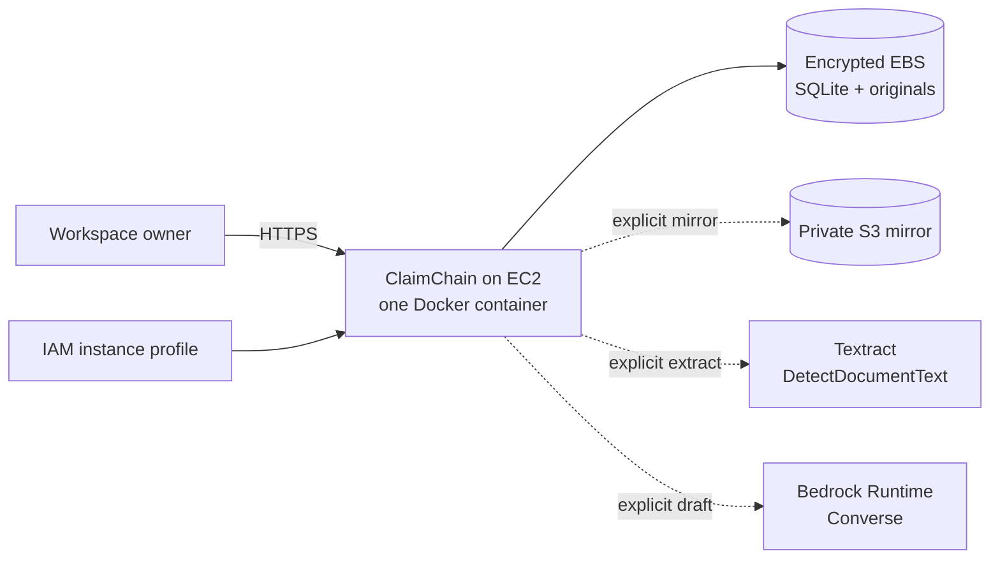

# AWS Architecture and Deployment

## Purpose and status

This chapter explains how AWS services fit ClaimChain and how to deploy the current single-instance application for a controlled competition demonstration.

**Current truth:** the repository contains executable AWS SDK v3 adapters and deployment packaging, but no AWS account, credentials, resources, or successful live deployment were supplied or verified here. “Proposed production” sections describe evolution, not shipped infrastructure.

## AWS service map

| AWS service                        | Release status          | Role                                                                |
| ---------------------------------- | ----------------------- | ------------------------------------------------------------------- |
| AWS Identity and Access Management | Required for deployment | Instance role and least-privilege S3, Textract, and Bedrock access  |
| Amazon EC2                         | Deployment-ready        | Runs the single Node/Docker process                                 |
| Amazon EBS                         | Deployment-ready        | Durable volume for SQLite and original evidence                     |
| Amazon S3                          | Optional/implemented    | Private encrypted mirror of original evidence with SHA-256 metadata |
| Amazon Textract                    | Optional/implemented    | Synchronous text detection for PNG/JPEG evidence up to 5 MiB        |
| Amazon Bedrock                     | Optional/implemented    | Review-required factual recovery-letter drafting through Converse   |
| AWS Systems Manager                | Recommended             | Session Manager access, patching, and secret/parameter delivery     |
| Amazon CloudWatch                  | Recommended             | Host/container logs, health alarms, disk monitoring, and dashboards |
| AWS Backup / EBS snapshots         | Recommended             | Recoverable copies of the persistent data volume                    |
| Amazon Route 53                    | Optional                | DNS for the public hostname                                         |
| Amazon ECR                         | Optional                | Versioned Docker image storage when builds move off-host            |

CloudFront, WAF, ALB, ECS/Fargate, RDS, Cognito, SQS, Step Functions, EventBridge, and SES belong to a proposed scaled architecture and are not needed to demonstrate this release.

## Current AWS integration flow



The server uses the default AWS SDK credential provider chain. On EC2, use an attached instance profile. Never bake long-lived keys into the image, commit them, or expose them through Vite variables.

## Implemented services

### Amazon S3: evidence mirror

`POST /api/evidence/:id/mirror` reads local original bytes and calls `PutObject` with:

- bucket from `S3_BUCKET`;
- key `evidence/<case-id>/<evidence-id>`;
- original content type;
- SSE-S3 (`AES256`);
- `sha256` object metadata.

Only a successful `PutObject` adds `cloudKey` and an “Evidence mirrored” event. Keep Block Public Access enabled, disallow public ACLs, enable versioning, and align lifecycle/retention with the evidence policy.

This is a mirror. Local evidence remains the download source and must still be backed up. Making S3 primary requires object retrieval authorization, retention/deletion behavior, and migration of existing files.

### Amazon Textract: evidence extraction

`POST /api/evidence/:id/extract` calls synchronous `DetectDocumentText` with in-memory bytes. The release accepts PNG/JPEG evidence up to 5 MiB and joins returned `LINE` blocks into reviewable text.

PDF/TIFF and multipage processing are not implemented. A future asynchronous flow would use S3, `StartDocumentTextDetection`, SNS/SQS or a worker for completion, and `GetDocumentTextDetection` for results.

### Amazon Bedrock: assisted drafting

With `BEDROCK_MODEL_ID` configured, document creation with `ai=true` calls Bedrock Runtime `Converse`. The model receives reviewed case fields, deterministic outstanding balance text, workspace identity, and filenames plus up to 8,000 characters of extracted text per evidence item.

The system instruction treats evidence as untrusted data, prohibits invented facts/legal provisions/threats/signatures/delivery claims, requests INR, and requires owner review. Inference uses temperature `0.2` and a 1,200-token ceiling.

The output is stored as an editable, unsent draft with provider `Amazon Bedrock - review required`. Model compatibility and availability vary by account and Region; use a Converse-compatible model or inference profile the role can invoke.

## Recommended competition deployment

The SQLite/filesystem design requires one application instance. Use EC2 with an encrypted EBS-backed data volume.

### 1. Prepare the account

- Choose one Region supporting the intended Textract and Bedrock operations. The default is `ap-south-1`.
- Confirm the selected Bedrock target supports Converse and is accessible.
- Create a private S3 bucket in the same Region with Block Public Access, encryption, and versioning.
- Create an EC2 role with only the permissions below.
- Ensure the application data volume and snapshots are encrypted.

### 2. Launch the host

- Use a supported AWS Linux AMI with enough memory for Node, uploads, PDF generation, and Docker builds.
- Attach the IAM role.
- Prefer administration through Systems Manager and avoid public SSH.
- Restrict inbound access to HTTPS; never expose application port `3001` publicly.

### 3. Configure the application

Create `.env` from `.env.example`:

```dotenv
HOST=0.0.0.0
PORT=3001
DATA_DIR=/app/data
SEED_SAMPLE=false

ACCESS_PASSWORD=<random 12+ character secret>
SESSION_SECRET=<independent random 32+ character secret>
COOKIE_SECURE=true
APP_ORIGIN=https://claims.example.com

AWS_REGION=ap-south-1
S3_BUCKET=<private bucket name>
ENABLE_TEXTRACT=true
BEDROCK_MODEL_ID=<Converse-compatible model or inference-profile ID>
```

Store production secret values in Systems Manager Parameter Store or Secrets Manager and materialize them at runtime. Do not commit the populated file.

### 4. Build and start

```sh
docker compose up -d --build
docker compose ps
curl http://127.0.0.1:3001/api/health
```

Compose binds the service to host loopback and stores `/app/data` in a named volume. Verify that Docker persists the volume on the intended EBS filesystem.

### 5. Add HTTPS

Put a maintained reverse proxy in front of `127.0.0.1:3001`. Caddy or Nginx can terminate a public certificate and forward to loopback; Route 53 can provide DNS. An ALB with ACM is possible, but do not add another application replica while SQLite is authoritative.

Required properties:

- HTTPS only, with HTTP redirected;
- `APP_ORIGIN` exactly matches the public origin;
- `COOKIE_SECURE=true`;
- proxy preserves host/forwarding headers;
- application port stays private.

### 6. Verify the deployment

1. Sign in and create a disposable case.
2. Upload a non-sensitive test PNG/JPEG.
3. Run Textract and confirm provider metadata plus an event.
4. Mirror to S3 and verify the private object and `sha256` metadata.
5. Generate a Bedrock draft and verify its review label.
6. Export and inspect the packet.
7. Restart the container and host; verify records and original bytes persist.
8. Record Region, AMI, instance type, image digest, model target, bucket, test time, and operator.

## Least-privilege IAM shape

Replace placeholders and keep only the Bedrock resource forms needed by the configured target.

```json
{
  "Version": "2012-10-17",
  "Statement": [
    {
      "Sid": "WriteClaimChainEvidence",
      "Effect": "Allow",
      "Action": ["s3:PutObject"],
      "Resource": "arn:aws:s3:::YOUR_BUCKET/evidence/*"
    },
    {
      "Sid": "ExtractEvidenceText",
      "Effect": "Allow",
      "Action": ["textract:DetectDocumentText"],
      "Resource": "*"
    },
    {
      "Sid": "DraftRecoveryLetters",
      "Effect": "Allow",
      "Action": ["bedrock:InvokeModel"],
      "Resource": [
        "arn:aws:bedrock:REGION::foundation-model/MODEL_ID",
        "arn:aws:bedrock:REGION:ACCOUNT_ID:inference-profile/PROFILE_ID"
      ]
    }
  ]
}
```

Cross-Region inference profiles can require permission for destination model resources. Confirm the exact policy with the selected model/profile documentation.

## Failure behavior

SDK clients use `maxAttempts: 2`. S3/Textract calls have a 30-second abort timeout; Bedrock has 45 seconds. Calls run in the request path.

If a cloud request fails:

- local evidence remains available;
- no cloud provider/key/success event is recorded;
- financial and stock state is untouched;
- the user receives an error rather than a false success.

At larger scale, move OCR and drafting behind durable jobs with idempotency, retries, dead-letter queues, and explicit job status.

## Backup and restore

Treat SQLite and `evidence/` as one unit:

1. Stop the container during a maintenance window.
2. Snapshot the complete EBS-backed data volume or copy the complete Docker volume.
3. Restart and verify health.
4. Periodically restore into a separate instance.
5. Verify database open, evidence download, PDF export, and one financial/inventory workflow.

Do not copy only the live `claimchain.sqlite` while WAL writes may be active. S3 mirrors are not a complete workspace backup.

Suggested demo targets, not guarantees: daily-snapshot RPO with an extra pre-demo snapshot, and one-to-four-hour RTO depending on automation.

## Monitoring checklist

Recommended CloudWatch coverage:

- EC2 status check, CPU, memory, and disk;
- container restarts and `/api/health` failures;
- reverse-proxy 4xx/5xx rate and latency;
- EBS capacity/burst metrics where relevant;
- S3/Textract/Bedrock errors and latency from sanitized structured logs;
- billing alarms and service quota review.

Never log uploaded contents, session tokens, passwords, or full model prompts.

## Proposed production evolution

To become a public multi-tenant service:

1. Replace the snapshot repository with tenant-scoped PostgreSQL on RDS.
2. Make S3 the primary evidence store with per-tenant prefixes, KMS, scanning, retention, and deletion.
3. Run stateless API replicas on ECS/Fargate behind an ALB.
4. Use Cognito or another identity provider and enforce tenant authorization per record.
5. Move OCR/drafting/reminders into SQS/EventBridge/Step Functions workers.
6. Add SES only with sender verification, consent, receipts, and bounce/complaint handling.
7. Add CloudFront/WAF, centralized secrets, CloudTrail review, migrations, alarms, and tested disaster recovery.

This is a new architecture, not a scaling toggle.

## Official AWS references

- [Amazon S3 `PutObject`](https://docs.aws.amazon.com/AmazonS3/latest/API/API_PutObject.html)
- [Amazon Textract `DetectDocumentText`](https://docs.aws.amazon.com/textract/latest/dg/API_DetectDocumentText.html)
- [Textract document byte/S3 limits](https://docs.aws.amazon.com/textract/latest/dg/API_Document.html)
- [Textract asynchronous operations](https://docs.aws.amazon.com/textract/latest/dg/api-async.html)
- [Amazon Bedrock Converse API](https://docs.aws.amazon.com/bedrock/latest/APIReference/API_runtime_Converse.html)
- [Bedrock model/API compatibility](https://docs.aws.amazon.com/bedrock/latest/userguide/models-api-compatibility.html)
- [Bedrock inference permissions](https://docs.aws.amazon.com/bedrock/latest/userguide/inference.html)
